# Survey System Entity Relationship Diagram

## Complete ERD for Survey Questions & Answers System

```mermaid
erDiagram
    %% Core Organization Tables
    CLIENT_PARTNERS {
        int id PK
        string name
        string description
        string contact_email
        string contact_phone
        timestamp created_at
        timestamp updated_at
    }
    
    CLIENTS {
        int id PK
        int client_partner_id FK
        string name
        string industry
        enum size
        string contact_email
        string contact_phone
        text address
        timestamp created_at
        timestamp updated_at
    }
    
    VENDORS {
        int id PK
        string name
        string industry
        string vendor_type
        string contact_email
        string contact_phone
        text address
        timestamp created_at
        timestamp updated_at
    }
    
    USERS {
        int id PK
        string email
        string password_hash
        enum role
        string name
        string phone
        text address
        boolean is_active
        timestamp last_login
        int client_partner_id FK
        int client_id FK
        int vendor_id FK
        timestamp created_at
        timestamp updated_at
    }

    %% Question Library System
    SUSTAINABILITY_QUESTIONS {
        int id PK
        string category
        int question_order
        text question_text
        string question_type
        string answer_type FK
        float effort_rating
        float impact_rating
        int max_points
        json answer_config
        json scoring_config
        json ui_metadata
        timestamp created_at
        timestamp updated_at
    }
    
    QUESTION_TYPE_CONFIGS {
        string type_name PK
        string display_name
        text description
        string input_component
        json validation_rules
        string scoring_method
        int default_points
        json ui_config
        boolean is_active
        timestamp created_at
        timestamp updated_at
    }

    %% Survey Template System
    SURVEY_TEMPLATES {
        int id PK
        int client_partner_id FK
        string template_name
        year survey_year
        text description
        boolean is_active
        int created_by FK
        timestamp created_at
        timestamp updated_at
    }
    
    SURVEY_TEMPLATE_QUESTIONS {
        int id PK
        int survey_template_id FK
        int question_id FK
        int question_order
        boolean is_required
        json custom_config
        timestamp created_at
    }

    %% Active Survey System
    ANNUAL_SURVEYS {
        int id PK
        int client_partner_id FK
        int client_id FK
        int vendor_id FK
        int survey_template_id FK
        year survey_year
        string survey_name
        text description
        enum survey_status
        boolean is_shared_survey
        int shared_survey_id FK
        date start_date
        date end_date
        int total_possible_points
        int actual_points_earned
        decimal completion_percentage
        timestamp submitted_at
        timestamp approved_at
        int approved_by FK
        timestamp locked_at
        int locked_by FK
        timestamp created_at
        timestamp updated_at
    }
    
    SURVEY_QUESTIONS {
        int id PK
        int annual_survey_id FK
        int question_id FK
        int question_order
        text answer_value
        json answer_data
        json answer_metadata
        int points_earned
        text notes
        timestamp answered_at
        enum validation_status
        json validation_errors
        json previous_year_answer
        int previous_year_survey_id FK
        timestamp created_at
        timestamp updated_at
    }

    %% Security & Audit System
    SURVEY_EDITING_LOCKS {
        int id PK
        int annual_survey_id FK
        int locked_by_user_id FK
        int locked_by_vendor_id FK
        string user_ip
        timestamp locked_at
        timestamp last_activity_at
        timestamp expires_at
    }
    
    SURVEY_ANSWER_AUDIT {
        int id PK
        int survey_question_id FK
        int changed_by_user_id FK
        enum change_type
        json previous_value
        json new_value
        int previous_points
        int new_points
        string user_ip
        text user_agent
        timestamp changed_at
    }

    %% Core Organization Relationships
    CLIENT_PARTNERS ||--o{ CLIENTS : "has many"
    CLIENT_PARTNERS ||--o{ USERS : "has many"
    CLIENTS ||--o{ USERS : "has many"
    VENDORS ||--o{ USERS : "has many"

    %% Question Library Relationships
    QUESTION_TYPE_CONFIGS ||--o{ SUSTAINABILITY_QUESTIONS : "defines answer type"

    %% Survey Template Relationships
    CLIENT_PARTNERS ||--o{ SURVEY_TEMPLATES : "creates templates"
    USERS ||--o{ SURVEY_TEMPLATES : "created by"
    SURVEY_TEMPLATES ||--o{ SURVEY_TEMPLATE_QUESTIONS : "contains questions"
    SUSTAINABILITY_QUESTIONS ||--o{ SURVEY_TEMPLATE_QUESTIONS : "included in templates"

    %% Active Survey Relationships
    CLIENT_PARTNERS ||--o{ ANNUAL_SURVEYS : "partners survey"
    CLIENTS ||--o{ ANNUAL_SURVEYS : "clients survey"
    VENDORS ||--o{ ANNUAL_SURVEYS : "vendors take"
    SURVEY_TEMPLATES ||--o{ ANNUAL_SURVEYS : "based on template"
    ANNUAL_SURVEYS ||--o{ ANNUAL_SURVEYS : "shares data with"
    USERS ||--o{ ANNUAL_SURVEYS : "approved by"
    USERS ||--o{ ANNUAL_SURVEYS : "locked by"
    
    ANNUAL_SURVEYS ||--o{ SURVEY_QUESTIONS : "contains questions"
    SUSTAINABILITY_QUESTIONS ||--o{ SURVEY_QUESTIONS : "question definition"
    SURVEY_QUESTIONS ||--o{ SURVEY_QUESTIONS : "previous year reference"

    %% Security & Audit Relationships
    ANNUAL_SURVEYS ||--o| SURVEY_EDITING_LOCKS : "locked for editing"
    USERS ||--o{ SURVEY_EDITING_LOCKS : "locked by user"
    VENDORS ||--o{ SURVEY_EDITING_LOCKS : "locked by vendor"
    
    SURVEY_QUESTIONS ||--o{ SURVEY_ANSWER_AUDIT : "answer changes tracked"
    USERS ||--o{ SURVEY_ANSWER_AUDIT : "changes made by"
```

## Key Relationships Explained

### **1. Survey Creation Flow**
- **Client Partners** create **Survey Templates** for each year
- **Templates** select questions from **Sustainability Questions** library
- **Annual Surveys** are created from templates for specific vendor-client-year combinations

### **2. Survey Sharing System**
- **Annual Surveys** can reference other **Annual Surveys** via `shared_survey_id`
- Vendors working for multiple clients under same partner share survey data

### **3. Question & Answer Flow**
- **Survey Questions** link **Annual Surveys** to specific **Sustainability Questions**
- **Answer data** stored in flexible JSON format based on **Question Type Configs**
- **Previous year answers** referenced for hint display

### **4. Security & Audit**
- **Survey Editing Locks** prevent concurrent editing
- **Survey Answer Audit** tracks every change with full context
- **User attribution** throughout the system for accountability

### **5. Answer Type System**
- **Question Type Configs** define how each answer type works
- **Sustainability Questions** reference answer types
- **Survey Questions** store actual answers in JSON format

This ERD shows the complete data model supporting all requirements: flexible question types, survey sharing, exclusive editing, audit trail, and lifecycle management!